# SpectralShipGen Studio User Guide

## What Is SpectralShipGen Studio?

SpectralShipGen Studio is a desktop application for generating, refining, inspecting, saving, and animating deterministic pixel-art spaceships produced by the separate SpectralShipGen C++ Library.

You do not need to understand the generator internals before using Studio. The most useful mental model is:

```text
Structural Profile = how the ship is built and shaped
Faction Profile    = technology / material / cultural flavor
Palette            = color language

Structural + Faction + Palette = what kind of ships to generate

Recipe             = one exact reproducible generated-ship description
Favorite           = one exact recipe you chose to keep in Studio
```

Built-in Profiles are convenience presets over the same semantic configuration system used by custom Profiles. They are not separate generator implementations.

## Two-Minute Quick Start

1. Launch `SpectralShipGenStudio.exe`. Studio opens in **Generate**.
2. Leave the defaults selected for your first ship, or use the **PROFILE**, **FACTION**, and **PALETTE** selectors in the Generate panel.
3. Press **Space** to generate a ship.
4. Press **Shift+Space** when you want a Gallery batch with several alternatives.
5. In Gallery, **left-click** a candidate to make it the primary selection. **Right-click** any candidates you want to keep as Favorites; you can keep several from the same Gallery.
6. Press **Enter** to accept the highlighted Gallery candidate as the current ship.
7. If you like most of a ship but want one part changed, press **3** for **Reroll** instead of discarding the whole ship.
8. Press **B** to bookmark the current ship when bookmarking is available, or use **SAVE PNG** to export its image.

That is enough to start. The other workspaces become useful when you want more control rather than merely another random ship.

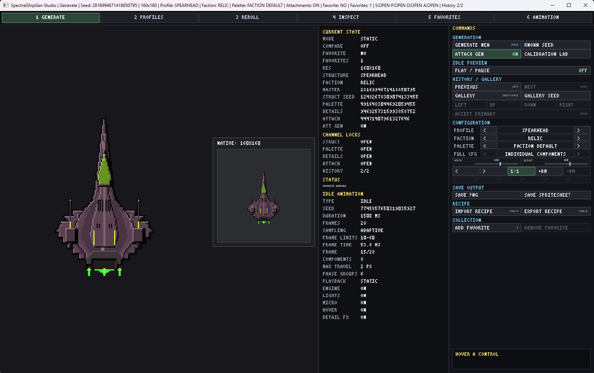

*Generate is the normal starting point: choose the generation setup, generate a ship, then move into the other workspaces only when you need them.*

Press **F1** in any workspace for contextual help. **Esc** backs out of the current context or closes an overlay; it never directly quits Studio. Use the window close button or **Alt+F4** to exit normally.

## Understanding Structural, Faction, and Palette

### Structural Profile — how the ship is built

Structural Profile controls broad construction and silhouette tendencies: hull form, wings, cockpit and engine placement, attachment capacity, negative space, complexity, and related structural behavior.

In the **Generate** workspace, this selector is labeled **PROFILE**. In the **Profiles** workspace, the same semantic layer is called **Structural**.

Use Structural when your thought is closer to:

> I want broader, heavier ships with more attachment capacity.

### Faction Profile — technology/material/cultural flavor

Faction Profile changes how a structural design is expressed: material and finish tendencies, weapon language, cockpit/engine preferences, surface detail, livery, palette tendencies, hierarchy, and faction animation response.

Use Faction when your thought is closer to:

> Keep this kind of silhouette, but make it feel like it belongs to a different civilization or military culture.

Changing Faction does not switch to a different generator. Structural and Faction remain independent semantic inputs that can be combined.

### Palette — color language

Palette controls color independently from Structural and Faction choices. Depending on the selected configuration, Studio can use faction-derived palette behavior, a generated palette profile, or a fixed semantic palette.

Use Palette when your thought is simply:

> I like the design, but I want a different color treatment.

## Seeds and Determinism

A seed is only one part of reproduction. For exact pixel reproduction, preserve:

- the recipe or equivalent semantic configuration;
- the deterministic seed state;
- the **exact SpectralShipGen Library release revision**.

Within the **same exact Library release revision**, the same validated semantic configuration and deterministic seed state produce the same generated `FinalImage` pixels.

Across different Library release revisions, pixel identity is not automatically guaranteed even when the public recipe remains readable. If exact reproduction matters, keep the exact Library release/tag/revision with the recipe.

## The Six Workspaces

Use the navigation bar or number keys **1–6**. All six workspaces share one current Studio session and current ship. Switching workspaces alone does not regenerate anything.

### 1 — Generate

Generate is the normal starting point.

The main configuration selectors are:

- **PROFILE** — Structural Profile;
- **FACTION** — Faction Profile;
- **PALETTE** — Palette;
- **FULL CFG** — saved Full Configuration bundle.

Common actions:

- **Space** — generate one ship;
- **Shift+Space** — generate/open Gallery;
- **Left/Right** — move through generation History when Gallery is not active;
- **Ctrl+O** — import a `.shipgen.json` Recipe;
- **Ctrl+E** — export the current Recipe;
- **B** — bookmark the current ship when available;
- **SAVE PNG** — save the current generated PNG;
- **SAVE SPRITESHEET** — save the current IDLE spritesheet where available.

Width and height are bounded integer sliders in the Generate panel. The exact values remain visible beside the controls.

#### Gallery

Gallery generates a deterministic batch of candidate recipes from the current generation setup.

- **Left-click** a candidate to make it the primary Gallery selection.
- **Right-click** a candidate to bookmark/unbookmark it immediately.
- You can therefore keep multiple Favorites from one Gallery batch.
- **Enter** accepts the highlighted primary candidate as the current ship.

Gallery candidates are immutable recipe snapshots. Editing generation settings while Gallery is open configures the **next** Gallery generation; it does not silently rewrite candidates already on screen.

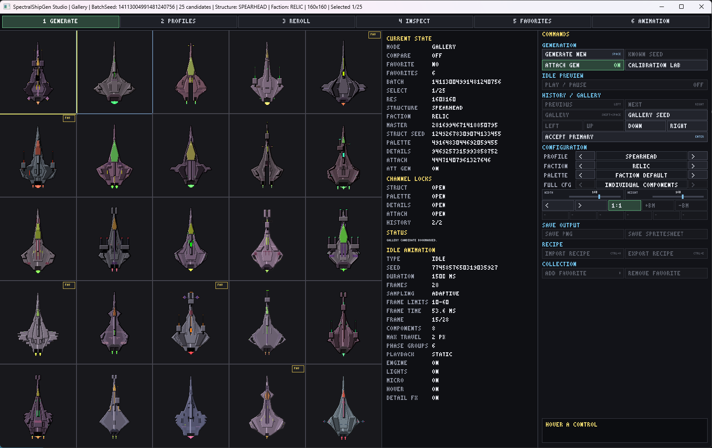

*Gallery lets you compare a batch at once. The highlighted candidate is the primary selection, while right-click bookmarking lets you keep several Favorites from the same batch.*

### 2 — Profiles

Profiles is where reusable authoring lives.

The **TYPE** selector switches between:

- Structural;
- Faction;
- Palette;
- Full Configuration.

The **SELECTED** selector chooses the built-in or local item in that category.

The main actions are **NEW / CURRENT**, **EDIT / INSPECT**, **DUPLICATE**, **DELETE**, **IMPORT**, and **EXPORT**. Full Configuration additionally supports **USE IN GENERATE**.

Built-in Structural/Faction/Palette items are immutable starting points. Opening one for editing creates a copy-style draft rather than mutating the built-in definition. Local saved items are user-owned and can be edited or deleted.

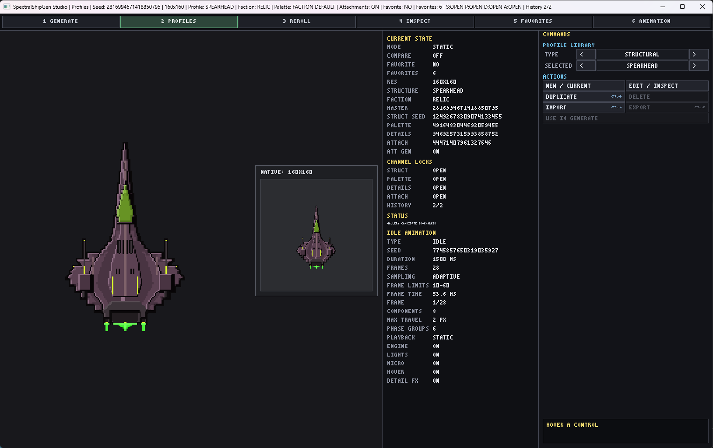

*Profiles is the reusable-authoring workspace. Switch **TYPE** to work with Structural, Faction, Palette, or Full Configuration entries.*

#### Editing numeric values

Profile editors keep the semantic Profile model authoritative; sliders are only an input mechanism.

For ordinary bounded integer settings:

- drag the horizontal track for a quick change;
- use the small **-** / **+** buttons for exact step-by-step adjustment;
- the displayed value is the exact integer that will be stored.

For settings represented as a bounded range, Studio shows two tracks in the same row:

```text
MIN <value>   [track]  - +     MAX <value>   [track]  - +
```

Drag **MIN** and **MAX** independently. The minimum cannot move above the current maximum, and the maximum cannot move below the current minimum. The small **-** / **+** buttons remain available for precise adjustment.

The same interaction pattern is used where appropriate in Structural, Faction, and Palette editors. Boolean and choice-like settings keep controls that better communicate their meaning rather than being forced into sliders.

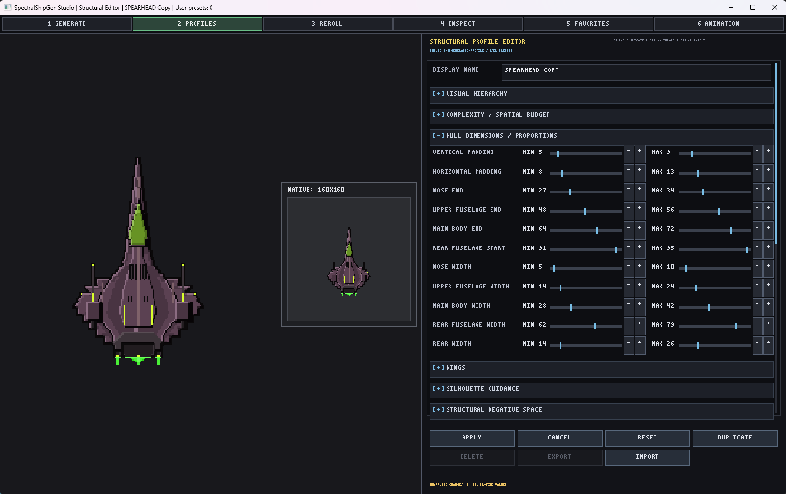

*Range rows expose both endpoints directly: drag for fast changes, then use the small **-** / **+** buttons when you want exact single-step adjustment.*

#### Creating and saving a custom Profile

A simple workflow is:

1. Switch **TYPE** to Structural, Faction, or Palette.
2. Choose a useful built-in or saved starting point with **SELECTED**.
3. Use **EDIT / INSPECT** to open it, or **DUPLICATE** when you explicitly want a saved copy immediately.
4. Change the fields you care about; scrolling reveals the full editor.
5. Use **APPLY** to save/apply the editable local result.
6. Use **EXPORT** if you want a portable `.shipgenpreset.json` copy outside the automatic local preset library.

Do not feel obligated to tune every field. Profiles are most useful when you want a reusable design language. If you merely want another ship from the same general setup, generating again is usually faster.

### 3 — Reroll

Reroll is for the situation:

> I like this ship, except for one part.

The current generation domains are:

- **HULL SHAPE**;
- **WINGS**;
- **COCKPIT**;
- **ENGINES**;
- **HULL LAYERS**;
- **MAJOR FEATURES**;
- **MACRO-ASYMMETRY**;
- **WEAPONS**;
- **ATTACHMENTS**;
- **PALETTE**;
- **DETAILS**.

Select the domains you want to change, then:

- **Space** — generate a reroll candidate;
- **Enter** — accept the current candidate.

Examples:

- "I like this ship except its weapons." → select **WEAPONS**.
- "Keep the geometry, try another color treatment." → select **PALETTE**.
- "Keep the major construction, change surface decoration." → select **DETAILS**.
- "Keep the general ship, try another cockpit." → select **COCKPIT**; downstream occupancy-dependent elements may adapt when required.

Reroll is non-destructive until you accept. The original recipe remains the base. Opening a Favorite in Reroll does not modify the stored Favorite.

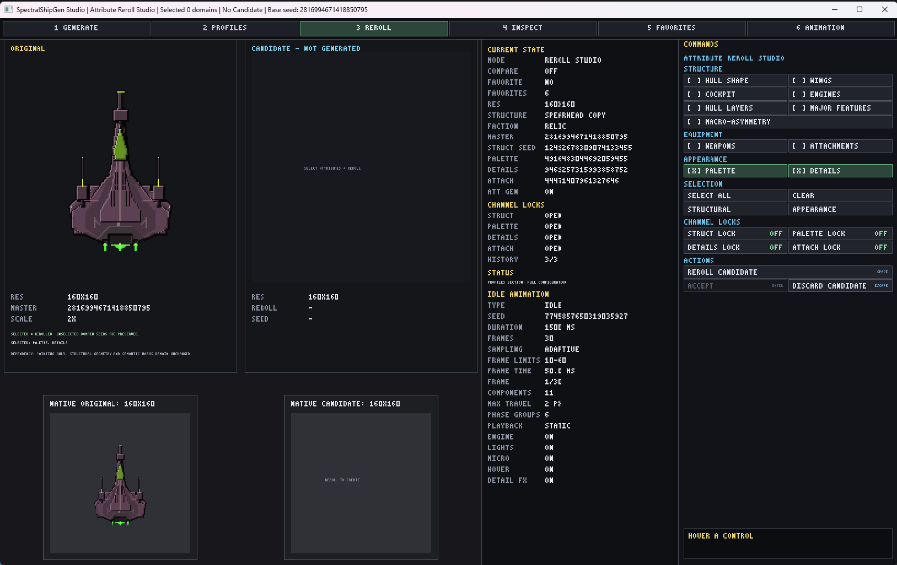

*Reroll is the "keep what works, change what does not" workflow. Only the selected domains are regenerated when you build a candidate.*

### 4 — Inspect

Inspect is a read-only view of **one current ship**.

It provides semantic structure/composition/constraint views, weapon and attachment information, generation-stage information, retained generation decisions, effective seed/domain information, and Overlay/Isolate presentation where applicable.

Inspect does not regenerate the ship.

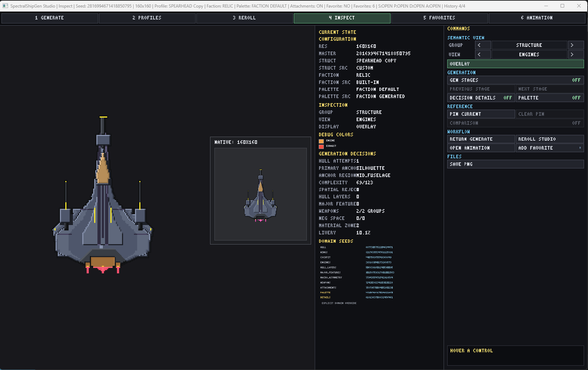

*Inspect is for understanding the current ship: semantic groups, generation decisions, effective domain seeds, and related retained information are presented without changing the result.*

Inspect is intentionally different from the separate Diagnostics application:

```text
Inspect         = understand one current ship
DiagnosticsApp  = generator-wide statistical/calibration/analysis workflows
```

### 5 — Favorites

Favorites is the persistent collection of ships you deliberately keep.

- Arrow keys move the selection.
- **Enter** opens the selected Favorite in Generate.
- **Delete** starts/confirms the explicit removal confirmation.
- **Ctrl+E** exports the selected Favorite Recipe.
- Mouse actions can open a Favorite in Inspect, Animation, or Reroll and can export its image.

The browser is paginated at 25 Favorites per page.

Favorites are recipe-backed rather than PNG-only thumbnails. The saved recipe is self-contained, so custom Structural/Faction/Palette values remain with the Favorite even if the local authoring Profile that originally produced it is later removed.

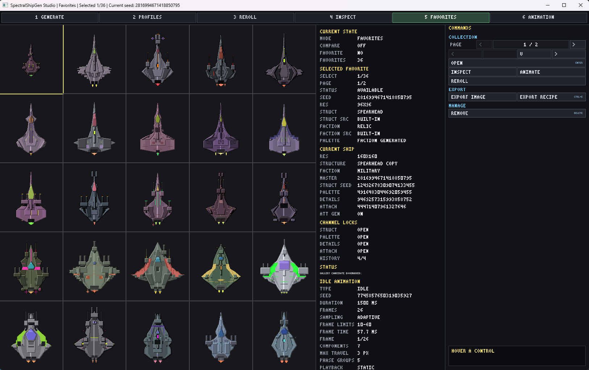

*Favorites keeps exact ships you chose to preserve. The browser can reopen them in Generate or send them into Inspect, Reroll, and Animation workflows.*

### 6 — Animation

Animation Lab works with the shared current ship and exposes the current Library animation model:

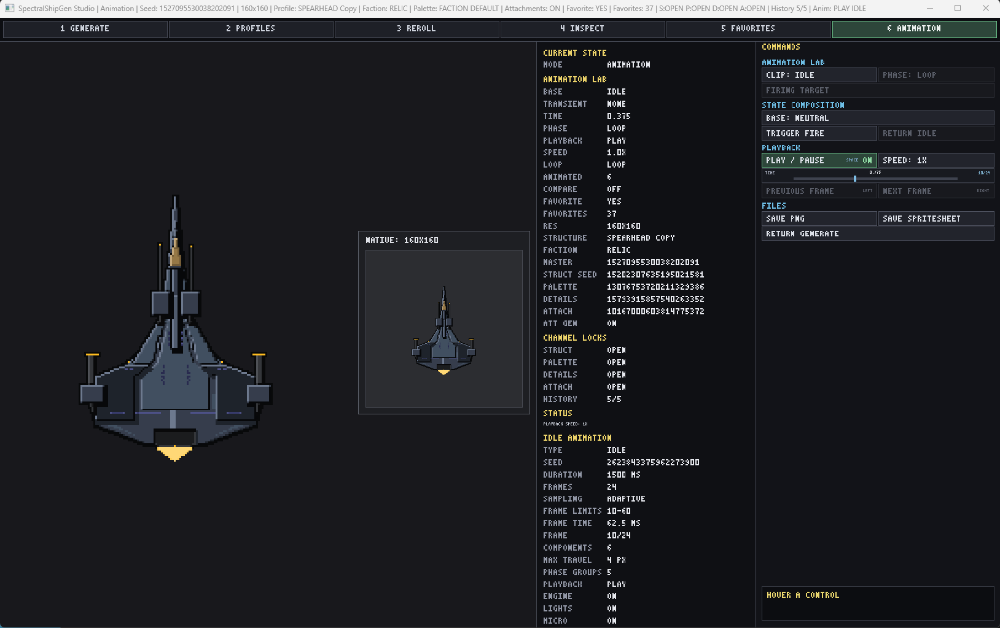

*Animation Lab uses the same current ship as the other workspaces and exposes playback, timeline, phase, and export controls.*

- **IDLE**;
- **MOVE LEFT**;
- **MOVE RIGHT**;
- **MOVE UP**;
- **MOVE DOWN**;
- **FIRE**;
- FIRE composed over the current movement posture;
- movement phases;
- normalized-time scrubbing;
- adaptive sampled-frame information;
- playback speeds.

Keyboard:

- **Space** — play/pause;
- **Left/Right** — previous/next sampled frame while paused.

Use **SAVE PNG** for the displayed frame and **SAVE SPRITESHEET** for the selected animation output where supported. Movement animation export can produce separate enter/sustain/exit spritesheets. Composed transient movement+FIRE previews are runtime presentation; export the underlying movement and FIRE assets separately.

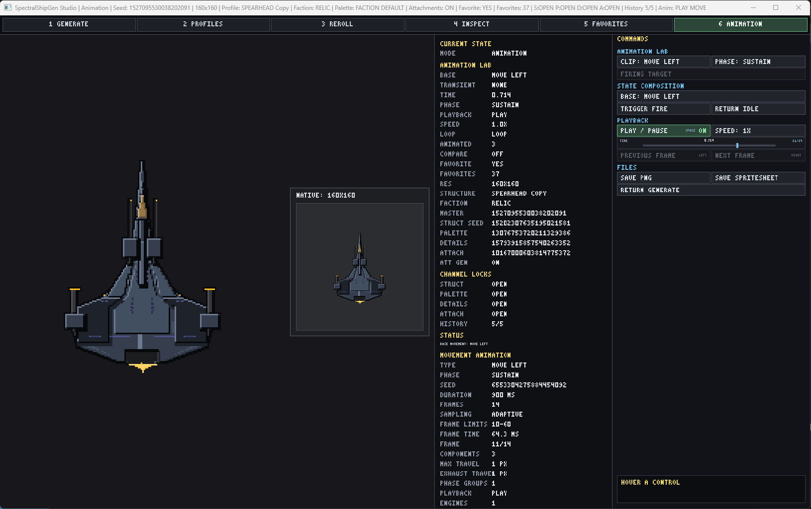

*Movement clips expose their semantic phase and sampled-frame position. FIRE can also be previewed in Animation Lab; its recoil/motion is easiest to judge during playback.*

Animation Lab is experimental in 1.0. It is an inspection/export workflow for generated animation, not a general-purpose animation editor or physics simulation.

## A Typical Workflow

A practical loop is:

```text
Generate several ships
    -> like the general direction?
       -> Profiles to refine reusable Structural/Faction/Palette behavior
    -> like one exact ship except one part?
       -> Reroll selected domains
    -> want to understand the result?
       -> Inspect
    -> want to keep it?
       -> Favorite it
    -> want motion/output?
       -> Animation
```

You do not need to visit every workspace for every ship.

## Full Configuration

A Full Configuration bundles the three reusable semantic generation components:

```text
Structural
+ Faction
+ Palette
```

It is useful when you find a combination you want to reuse as one unit.

In Profiles, switch **TYPE** to Full Configuration. A new Full Configuration starts from the current Structural, Faction, and Palette components. Saved bundles can be selected and **USE IN GENERATE** applies their three components to the shared generation session.

A Full Configuration does **not** represent one exact generated ship. Seed, ship dimensions, and one particular generated result are separate concepts.

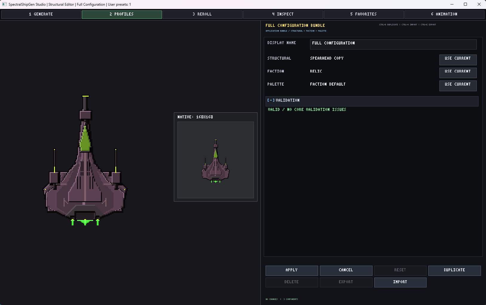

*Full Configuration packages the three reusable semantic layers together. It is a reusable generation setup, not an exact generated ship.*

## Profile vs Full Configuration vs Recipe vs Favorite

| Item | What it represents | Best use |
|---|---|---|
| **Profile** | One reusable semantic layer: Structural, Faction, or Palette | Reuse one design/color language across many ships |
| **Full Configuration** | Structural + Faction + Palette together | Reuse a whole generation setup |
| **Recipe** | One self-contained deterministic generated-ship description | Reproduce/move one exact ship state |
| **Favorite** | A Studio collection entry backed by a Recipe | Keep and browse exact ships you liked |

A Favorite is not a reusable Profile. A Full Configuration is not a generated Favorite. A Recipe is the portable exact-ship description rather than a replacement for your local preset library.

## Saving, Persistence, and Portable Folders

Studio writes its automatic local authoring state relative to its **working directory**:

- `spectral_ship_gen_preview_user_presets.json` — saved Structural, Faction, Palette, and Full Configuration items;
- `spectral_ship_gen_preview_favorites.json` — Favorites collection;
- `spectral_ship_gen_preview_preferences.json` — Preview preferences.

When using the portable Windows package, the simplest setup is to keep a stable extracted application folder and launch Studio from that folder. If you move the portable setup and want the same Favorites/presets/preferences, move those generated JSON files with it.

They are user-created local files and are not included in a clean distribution ZIP.

### Portable authoring files

Use exports when you want explicit files that can be moved independently:

- `.shipgenpreset.json` — Structural/Faction/Palette authoring export;
- `.shipgenbundle.json` — Full Configuration export;
- `.shipgen.json` — public SpectralShipGen Recipe.

Import commands currently ask for the input path in Studio's console window. Profile imports prompt for `.shipgenpreset.json`; Full Configuration imports prompt for `.shipgenbundle.json`; Recipe imports prompt for `.shipgen.json`.

## Exporting

Studio writes exports into the current working directory using descriptive generated filenames. If a filename already exists, Studio adds a numeric suffix instead of silently overwriting it.

Current normal-user outputs include:

- **SAVE PNG** — static PNG of the current/generated frame;
- **SAVE SPRITESHEET** — IDLE or selected Animation Lab spritesheet output where supported;
- **EXPORT RECIPE** / **Ctrl+E** in the relevant workflow — `.shipgen.json`;
- Profiles **EXPORT** — `.shipgenpreset.json` or `.shipgenbundle.json` depending on the active type;
- Favorites **EXPORT IMAGE** — PNG regenerated from the saved Favorite recipe.

Generated/exported image data stays at its native generator resolution. Resizing the Studio window only scales presentation and does not resample exported ships or spritesheets.

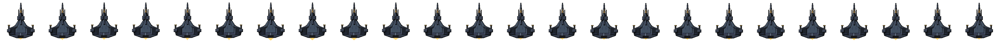

*Example native-resolution IDLE spritesheet export produced by Animation Lab.*

## Window Size and Display Requirements

Studio uses a fixed **1640×1000 logical design space**, but the desktop window is normally resizable and maximizable.

- Native resize/maximize/restore are supported on Windows.
- The interface keeps its proportions rather than stretching independently in X and Y.
- A wider window may show empty bars on the left/right; a taller or narrower window may show bars above/below. This is normal aspect-preserving presentation.
- Mouse input remains mapped to the visible logical interface; unused bar regions do not activate controls.
- Resizing does not regenerate a ship or reset the current workspace/configuration/session state.
- If the normal 1640×1000 client area does not fit the Windows desktop work area at startup, Studio chooses a smaller initial physical window that fits while preserving the UI aspect ratio.

### Display recommendation

**1920×1080 or higher is recommended** for the most comfortable and fully readable experience.

Studio remains **functionally usable at lower resolutions down to 1280×720**. At that scale the entire application remains reachable and controls remain usable, but some of the smallest helper text can be difficult to read comfortably.

Therefore:

- 1920×1080 or higher — **recommended / fully readable**;
- lower resolutions down to 1280×720 — **usable, but not recommended for the most comfortable experience**;
- 1280×720 should not be described as fully comfortable or fully readable.

No broader cross-platform/high-DPI guarantee is implied by the Windows validation above.

## Windows x64 Portable Version

The first-party 1.0 RC portable package is Windows x64.

Typical use:

1. Extract the entire ZIP to a normal writable folder.
2. Double-click `SpectralShipGenStudio.exe`.
3. Keep the extracted folder as the working folder if you want local Favorites/presets/preferences to travel with that portable setup.

The supported package links SFML statically, so it does **not** require `sfml-*.dll` files beside the executable.

The Release executable uses the normal dynamically linked Microsoft C++ runtime. **Microsoft Visual C++ 2015–2022 Redistributable (x64) may be required** on a machine where it is not already installed. The validated executable depends on runtime components including `MSVCP140.dll`, `VCRUNTIME140.dll`, and `VCRUNTIME140_1.dll`.

If Windows reports that one of those runtime DLLs is missing, install the Microsoft Visual C++ 2015–2022 Redistributable (x64); do not search for individual DLL downloads.

See `WINDOWS_PORTABLE.md` included with the portable distribution for package-specific details.

## Generated Output Rights

Images, spritesheets, animation frames, and other output generated with SpectralShipGen or SpectralShipGen Studio may be used **for any purpose**, including commercial use.

You may:

- modify or paint over the output;
- redistribute or publish it;
- sell it;
- use it in games, applications, media, prototypes, or placeholders;
- use it as a starting point for manual pixel-art editing.

**No attribution is required.**

The zlib/MPL software licenses apply to the software source, not to generated output.

If you create an interesting or funny result, showing it to the project is appreciated, but sharing is completely optional.

## Is the Artwork AI Generated?

Development and coding of SpectralShipGen and Studio were AI-assisted.

The generated ship artwork itself is **not produced by an image-generation model**. No reference images are supplied to an image model, and there are no hidden base sprites being chopped up and recombined.

Ship pixels are produced by explicit C++ procedural systems such as seeded deterministic decisions, geometry and masks, component placement, palette/detail systems, and animation systems.

## Keyboard / Input Reference

Studio is primarily mouse-driven. Current keyboard shortcuts are:

### Global

```text
1-6          Switch workspaces
F1           Contextual Help
Esc          Back / Cancel / Close overlay; never quits directly
B            Bookmark current ship when available
```

### Generate

```text
Space        Generate one ship
Shift+Space  Generate Gallery
Left/Right   History navigation outside Gallery
Ctrl+O       Import Recipe
Ctrl+E       Export current Recipe
```

### Profiles

```text
Ctrl+D       Duplicate selected item
Ctrl+O       Import active Profile/Full Configuration type
Ctrl+E       Export selected saved item
```

### Reroll

```text
Space        Generate reroll candidate
Enter        Accept candidate
```

### Favorites

```text
Arrows       Move selection
Enter        Open selected Favorite in Generate
Delete       Begin/confirm removal
Ctrl+E       Export selected Favorite Recipe
```

### Animation

```text
Space        Play/pause
Left/Right   Previous/next sampled frame while paused
```

Keyboard shortcuts are suppressed while an editor/text field owns keyboard focus.

## Practical Use Cases

SpectralShipGen is useful for:

- rapid prototypes and placeholders;
- game jams;
- games that need many visually related ships;
- runtime/procedural generation experiments;
- quickly exploring combinations of structural, faction, and palette ideas;
- producing a starting point for manual pixel-art editing;
- experimentation and fun.

The generator is not presented as a replacement for a skilled pixel artist. A human artist can create more deliberate, expressive, and polished work; Studio is useful when procedural variety, iteration speed, deterministic generation, or a starting point is valuable.

## FAQ and Common Confusion

### What is the difference between Structural and Faction?

Structural describes **how the ship is built/shaped**. Faction describes **how that construction is expressed technologically, materially, and culturally**. They are independent semantic layers and can be mixed.

### Why does Generate say PROFILE instead of Structural?

The Generate panel's **PROFILE** selector is the Structural Profile selector. The Profiles workspace uses the more explicit **Structural** category name.

### What is a Full Configuration?

A reusable bundle of Structural + Faction + Palette. It describes a reusable generation setup, not one exact generated ship.

### Profile, Recipe, or Favorite?

Use a **Profile** for one reusable semantic layer. Use a **Recipe** for one exact deterministic generated-ship description. Use a **Favorite** to keep/browse one exact Recipe inside Studio.

### Does changing the seed change the whole ship?

The master/deterministic seed state participates in generation across domains. If you want to change only selected aspects of a ship you already like, use **Reroll** rather than replacing the whole generation state casually.

### Can I reproduce the same ship later?

Yes, when you retain the recipe/configuration, deterministic seed state, and the same exact SpectralShipGen Library release revision.

### Why might the same Recipe produce different pixels after upgrading the Library?

Recipe readability is a compatibility promise; permanent cross-release pixel identity is not. Exact pixels are guaranteed only for the same exact Library release revision plus the same validated semantic input and seed state.

### Can I use generated ships commercially? Do I need to credit SpectralShipGen?

Yes, commercial use is allowed. No attribution is required for generated output.

### Where are my Favorites and custom Profiles stored?

In JSON files relative to Studio's working directory. For a portable setup, keep those generated files with the same portable folder when moving it.

### Where did my exported file go?

Normal exports are written to Studio's current working directory. Generated filenames are shown in the application status/console output where applicable.

### Why did the same seed produce a different ship after upgrading?

The deterministic guarantee is scoped to the **same exact SpectralShipGen Library release revision** plus the same semantic configuration and deterministic seed state.

### Why can't I edit a built-in Profile directly?

Built-ins are stable immutable starting points. Editing one opens a copy-style draft; save/apply the local result rather than mutating the built-in definition.

### Why didn't changing settings alter the Gallery ships already on screen?

Gallery candidates are Recipe snapshots. Your setting change configures the **next** Gallery generation; it does not rewrite existing candidates.

### Why is my Favorite unchanged after Reroll?

Favorites are deliberately non-destructive. Reroll works from the Favorite's Recipe, but the saved Favorite changes only if you separately keep/bookmark the new result.

### Why do I see empty bars beside or above/below Studio after resizing?

Studio preserves the 1640×1000 UI aspect ratio instead of stretching it. The empty regions are normal letterbox/pillarbox space and are not interactive.

### What display resolution should I use?

1920×1080 or higher is recommended. Studio remains functionally usable down to 1280×720, but some of the smallest helper labels become difficult to read at that scale.

### Windows says a Visual C++ runtime DLL is missing. What do I need?

Install the **Microsoft Visual C++ 2015–2022 Redistributable (x64)**. The portable package statically links SFML but uses the normal dynamic Microsoft C++ runtime.

### Why doesn't Esc quit?

This is intentional. **Esc** backs out of contexts and closes overlays. Use the window close button or **Alt+F4** to exit.

## Troubleshooting

### A control is too small to read at a low resolution

Maximize or enlarge the window if possible. The application remains usable down to 1280×720, but the smallest helper text is intentionally documented as a lower-resolution readability limitation. A 1920×1080-or-higher display is recommended.

### A click does not affect anything in the empty window border area

That is expected. Letterbox/pillarbox regions are outside the logical Studio UI and do not activate controls.

### My portable Favorites/presets/preferences disappeared after launching from another folder

Those files are working-directory-relative. Return to the previous working directory or copy the three local JSON files into the working directory you intend to use.

### Recipe/Profile import is waiting for input

Import currently asks for a path in Studio's console window. Enter the requested `.shipgen.json`, `.shipgenpreset.json`, or `.shipgenbundle.json` path there.

### FIRE animation is unavailable

A generated ship needs a movable weapon component for the FIRE animation workflow. Generate/select a ship with an appropriate weapon and try again.
